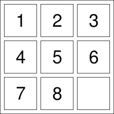

# 8-puzzle
## Giới thiệu về chương trình ##
- Xuất phát từ một game xếp hình cực kỳ quen thuộc với chúng ta - Game 8-puzzle , bài toán đặt ra là liệu có một thuật giải có thể đưa ra được một cách giải cho một cấu hình bất kỳ với số lần di chuyển là tối thiểu. Chương trình được xây dựng nhằm tìm ra câu trả lời đó.
**Lưu ý rằng, mục tiêu của dự án này chỉ là tìm ra thuật giải, do vậy mình sẽ không xây dựng đồ họa mà làm hoàn toàn trên console (100% code C)**

## Hướng dẫn sử dụng chương trình ##
1. *Chơi một game bình thường*
- Một bảng 9 ô với kích thước 3x3 sẽ xuất hiện. Trên đó có các số đánh số từ 0 đến 8, với số 0 có thể coi như là vị trí trống (có tối đa 4 ô xung quanh có thể di chuyển tới ô 0 này - tối đa 4 cách di chuyển trong 1 lượt).
- Các ô có thể di chuyển được là các ô được đánh số từ 1 đến 8. Nhiệm vụ của bạn là di chuyển một ô mỗi lượt cho đến khi bảng này có vị trí các ô như bên dưới:

***1 2 3***

***4 5 6***

***7 8 0***

Đây được gọi là cấu hình chuẩn của bảng

2. *Đoán tính khả chuẩn*
- Một bảng ngẫu nhiên sẽ được sinh ra với các quy tắc y hệt như phần 1, và bạn có thể lựa chọn tự tạo ra bảng đấy hay để máy tạo. Tuy nhiên bảng này khác với bảng ở phần 1 ở chỗ, cho dù có di chuyển như thế nào đi chăng nữa, thì có khả năng sẽ không thể đưa được bảng đó về cấu hình chuẩn, tức là không giải được (đối lập với bảng có thể giải được, hay còn gọi là có tính khả chuẩn)
- Nhiệm vụ của bạn sẽ là xem bảng có tính khả chuẩn hay không. Và nếu bảng đó có tính khả chuẩn, bạn có thể lựa chọn để máy giải tự động, hoặc tự giải như phần 1.
